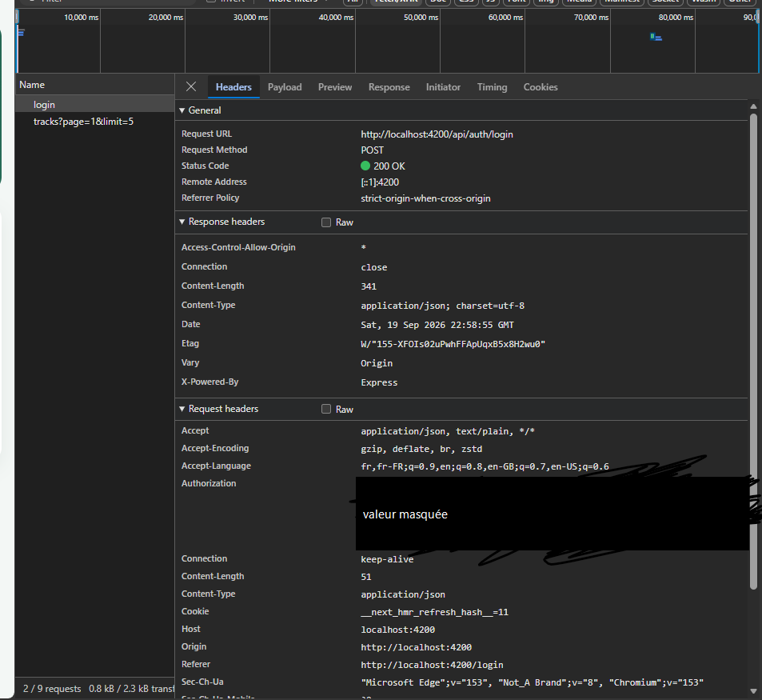
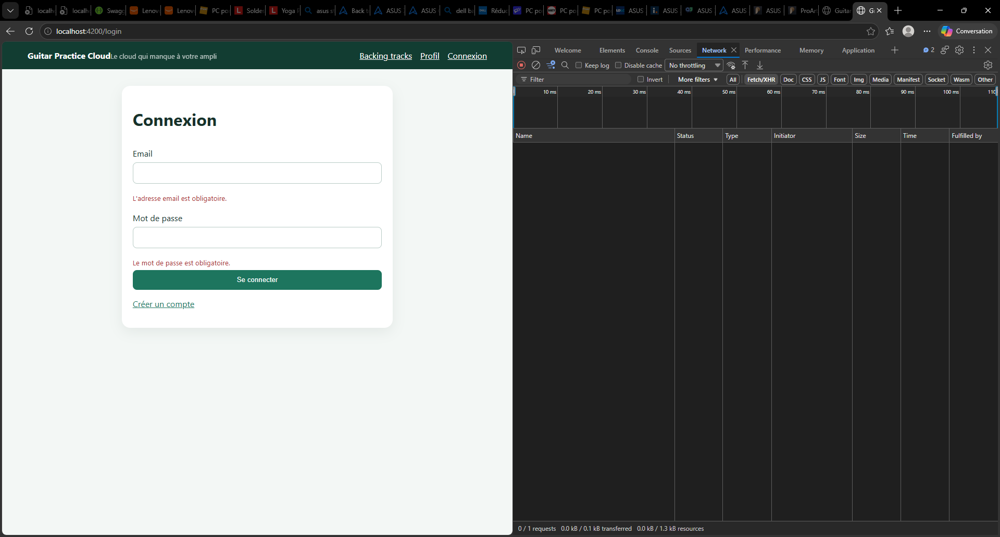
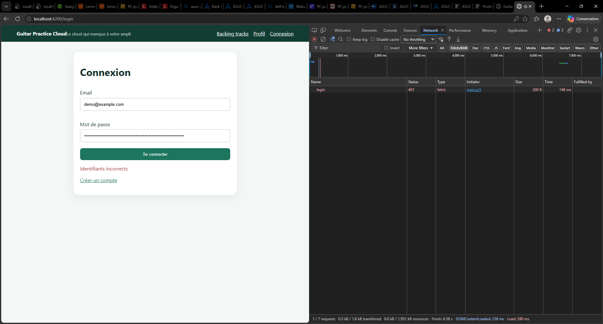
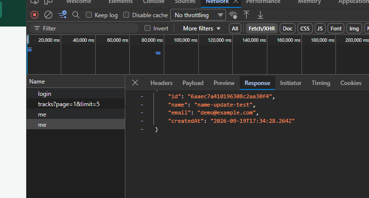

# Rapport d'usage de l'IA - TP1

Pour chaque mission, détailler et fournir des explications concernant : objectif; prompt principal; plan proposé par l'agent; vérifications réalisées par le binôme; erreurs ou propositions rejetées; fichiers effectivement modifiés; preuve de fonctionnement; ce que chaque membre sait maintenant expliquer sans l'agent.

## Outil utilisé

- Assistant : Claude Code, extension VS Code (agent de projet : lit les fichiers du dépôt et lance des commandes dans le terminal).
- Modèle : Claude Sonnet 5.
- Consommation de tokens : à compléter (à relever dans l'outil).
- Travail réalisé seul pour l'instant (pas encore de binôme).

## Mission 0 — Cartographier l'application

**Objectif.** Comprendre l'architecture de l'application sans modifier le code : retrouver le composant racine, la configuration des routes, l'enregistrement de `HttpClient`, les modèles, services et pages, et le mécanisme qui ajoute le JWT. Produire un schéma annoté du flux d'un clic sur « Se connecter » et distinguer les routes publiques des routes protégées.

**Prompts, dans l'ordre réel.**

*Phase 1 — lecture du dépôt et cartographie (messages courts, en anglais).* Après la lecture des documents du dépôt (« go on explain to me everything », « show me the complete architecture », « draw the architecture of the code base »), j'ai collé le texte de la Mission 0 avec la question « what to do here », puis demandé où placer les réponses (« where should i put the answer ») et de les rédiger (« put the answers »). Les réponses ont été écrites dans `docs/tp1/`.

*Phase 2 — prompts structurés (synthèse et fichier de référence), envoyés ensuite.* Rédigés d'après le modèle du guide du cours (§5 et §6) :

> **Prompt 1.** You are my development assistant for this project: an Angular 22 frontend in frontend-starter/ and an Express/Mongoose backend in backend/.
>
> First read README.md and API_CONTRACT.md. Then analyze each part separately, without modifying any file:
> 1. frontend-starter/: its AGENTS.md and best-practices.md, then the code under src/.
> 2. backend/: its AGENTS.md and best-practices.md, then src/ and test/.
>
> For each part give me: its role, tech stack, entry point, an annotated folder tree, the key files and what each is responsible for, the data flow, and the rules I must follow. Cite file:line, and verify every line reference in the code before citing it. Never read or display .env, secrets or tokens.
>
> End with the points where the two parts connect (the API contract) and a list of anything you could not verify. Answer in English.

> **Prompt 2.** Based on that analysis, read all the files concerned by Mission 0 of TP1 (SUJET_ETUDIANT_TP1.md, main.ts, routes.ts, shared/, components/, app.js, the models).
>
> Do not modify anything yet. First propose a plan for an AGENTS.md at the repo root, plus a CLAUDE.md that points to it, meant as your reference for future sessions. It should cover: what the application is for, architecture and data flow, folder layout, how to run it, the rules from the repo's own guidance files, the TP constraints (backend is read-only), our working rule (plan first, wait for my approval before any change), and a per-mission progress log.
>
> Requirements: factual and neutral, no secrets, no judgment about the provided code, short (around 80 lines, linking to docs/ instead of copying), written in French. It must include the rule "update this file after every mission". Wait for my approval before writing anything.

> **Prompt 3.** Save to your memory that the AGENTS.md at the repo root must be updated after every mission (mission log, plus any change to the architecture or rules), and note where that file lives.

**Analyse des prompts.** Ceux de la phase 1 étaient courts, sans contrainte explicite ni critère de réussite, et s'appuyaient sur le contexte de la lecture précédente. Ceux de la phase 2 suivent le modèle du guide : objectif, fichiers à lire, ce qui est interdit (modification, secrets), format de sortie, vérification des références de lignes, liste de ce qui n'a pas pu être vérifié, et validation obligatoire avant toute écriture.

**Fichiers consultés par l'assistant.** README, `API_CONTRACT.md`, `SUJET_ETUDIANT_TP1/2/3.md`, `CONSEILS_POUR_UTIISER_ASSISTANT_AI.md`, `ATLAS_SETUP.md`, `AGENTS.md` et `best-practices.md` (backend et frontend), `backend/src/app.js`, `server.js`, `models/User.js`, `models/Track.js`, `backend/test/api.test.js`, `frontend-starter/src/main.ts`, `routes.ts`, les services, l'intercepteur, le guard, les modèles, les cinq composants, `proxy.conf.json`, `package.json`, `angular.json`. Jamais le fichier `.env`.

**Plan proposé par l'agent.**
- Mission 0 :
  1. Retrouver les cinq éléments du frontend avec une recherche dans les fichiers (`bootstrapApplication`, `provideRouter`, `provideHttpClient`, `Authorization`).
  2. Étiqueter chaque route du contrat comme publique ou protégée, puis vérifier dans `app.js` la présence du middleware `auth`.
  3. Dessiner le flux de connexion en étapes numérotées avec fichier et ligne, côtés Angular et Express.
- `AGENTS.md` (proposé avant écriture, dix sections, environ 85 lignes) : objet du fichier, application, architecture et flux, arborescence, lancement, règles du dépôt, contraintes des TP, méthode de travail, journal des missions, maintenance. `CLAUDE.md` de cinq lignes qui renvoie vers `AGENTS.md`.

**Vérifications réalisées.**
- Références de lignes vérifiées par recherche dans les fichiers et par lecture numérotée, côtés backend et frontend, avant d'être citées.
- Environnement lancé pour observer le comportement réel : backend connecté à MongoDB Atlas (`/api/health` répond `200`, compte de démonstration présent), frontend sur le port 4200.
- Onglet Network des DevTools : connexion réussie (`200`, corps `{token, user}`) et connexion refusée avec un mauvais mot de passe (`401`, message « Identifiants incorrects »).
- Plan de `AGENTS.md` relu puis validé (« go ») avant l'écriture. Après écriture : 79 lignes, aucune chaîne de type secret ou identifiant, les 24 chemins référencés existent. Relecture du diff avant le commit.

**Erreurs ou propositions rejetées.**
- L'assistant avait affirmé que l'intercepteur n'agit pas sur la requête de connexion, faute de jeton. Les DevTools ont montré un en-tête `Authorization` sur cette requête : un jeton était déjà enregistré, et l'intercepteur n'a aucun filtre sur l'URL. Explication corrigée dans le schéma.
- L'assistant avait d'abord estimé que la partie authentification du TP1 était déjà entièrement réalisée par le code fourni. La relecture de la Mission 1 a montré des éléments à faire : messages de validation, bouton de déconnexion, gestion du `401`.
- L'assistant avait proposé de reformuler après coup un prompt dans le rapport. J'ai refusé : le rapport ne cite que les prompts réellement envoyés, et j'ai envoyé les prompts structurés ci-dessus.
- Problèmes d'environnement rencontrés : la version de Node (22.14.0) était trop ancienne pour Angular CLI (minimum 22.22.3), mise à jour en 22.23.2 ; la résolution DNS des enregistrements SRV était refusée sur ce réseau, la connexion MongoDB utilise donc la forme standard `mongodb://` dans mon `.env` local (non versionné).

**Fichiers effectivement modifiés.** Créés : `docs/tp1/mission0.md` et `docs/tp1/login-flow.md`, puis `AGENTS.md` et `CLAUDE.md` à la racine. Aucun fichier de code modifié. Le fichier `backend/.env` a été créé en local et n'est pas versionné. Hors dépôt : la règle « mettre à jour `AGENTS.md` après chaque mission » a été enregistrée dans la mémoire de l'assistant.

**Preuve de fonctionnement.** Commit `7b8adb3` (cartographie et schéma du flux) et commit `831e597` (`AGENTS.md` et `CLAUDE.md`). Capture de la requête de connexion dans les DevTools (un jeton était déjà enregistré : l'en-tête `Authorization` est présent, sa valeur est masquée) :
  

**Ce que je sais maintenant expliquer sans l'agent.** *(à confirmer après un auto-test à voix haute)*
- Le trajet complet d'un clic sur « Se connecter » : composant, `AuthService`, intercepteur, proxy, Express, modèle, MongoDB, puis retour, stockage du jeton et redirection.
- Pourquoi le composant ne fait jamais d'appel HTTP direct et passe par le service.
- Ce que fait l'intercepteur et pourquoi il ajoute le jeton à toutes les requêtes, y compris celle de connexion.
- Quelles routes sont publiques ou protégées, et comment le middleware `auth` le décide.
- Le rôle du proxy de développement (`proxy.conf.json`) et pourquoi le navigateur ne parle qu'au port 4200.
- À quoi sert `AGENTS.md` pour un assistant IA, et pourquoi il doit être mis à jour après chaque mission.

## Mission 1 — Inscription, connexion et profil

### Étape 1 — Validation des formulaires et messages d'erreur

**Objectif.** Formulaires d'inscription et de connexion avec des validations et des messages d'erreur compréhensibles (deuxième point de la Mission 1), sans double soumission.

**Prompts.** J'ai collé le texte de la Mission 1 dans l'assistant, sans consigne supplémentaire. L'assistant a proposé un plan en quatre étapes ; j'ai répondu « go » pour lancer l'étape 1 avec les choix par défaut proposés (profil inclus dans le plan, jeton limité aux requêtes `/api`, pré-remplissage de démonstration conservé, code écrit par l'assistant puis relu et expliqué par moi).

**Plan proposé par l'agent (étape 1).** Inscription : nom d'au moins 2 caractères (après suppression des espaces, comme le backend) et mot de passe d'au moins 8 caractères. Connexion : champs obligatoires et email valide. Messages par champ une fois le champ touché, Signal `submitting` qui désactive le bouton et bloque la double soumission, message du serveur affiché, cas « serveur injoignable ». Un utilitaire partagé `httpErrorMessage` évite de dupliquer la règle dans chaque page.

**Vérifications réalisées.**
- `npm run build` réussi (typage strict des templates inclus).
- 26 vérifications automatisées dans un navigateur Edge sans interface, toutes réussies : champs vides, email invalide, mauvais mot de passe, inscription avec champs trop courts, email déjà utilisé, inscription valide, serveur injoignable (simulé), double clic sur une réponse lente.
- Contrôle manuel dans mon navigateur : champs vides (deux messages, aucune requête dans l'onglet Network), mauvais mot de passe (une requête `401`, message « Identifiants incorrects », bouton réactivé), inscription avec nom et mot de passe trop courts (deux messages, aucune requête).
- Journaux : seul le statut HTTP est affiché, jamais de jeton ni de mot de passe.

**Erreurs ou propositions rejetées.** Aucune pour cette étape. Observation : l'espacement des messages d'erreur est inégal (message collé au bouton) ; correction reportée à la fin de la mission.

**Fichiers effectivement modifiés.** `login-page.ts` et `.html`, `register-page.ts` et `.html`. Créé : `shared/utils/http-error-message.ts`. Le backend n'est pas modifié.

**Preuve de fonctionnement.** Commit `ce12aff`. Captures de l'onglet Network (filtre Fetch/XHR) :
- Champs vides : deux messages d'erreur, aucune requête envoyée (« 0 / 1 requests »).
  
- Mauvais mot de passe : une requête `login` en `401`, message « Identifiants incorrects », bouton réactivé.
  
- État initial de la page de connexion (avant toute action) : `docs/tp1/img/step1-01-connexion-etat-initial.png`.

**Ce que je sais maintenant expliquer sans l'agent.** *(à confirmer avant de clore la mission)*
- Pourquoi `if (this.submitting()) return;` est nécessaire en plus du bouton désactivé.
- Pourquoi le template écrit `errors['required']` (signature d'index et `noPropertyAccessFromIndexSignature`).
- Pourquoi les journaux d'erreur n'affichent que le statut.
- Pourquoi `httpErrorMessage` est dans `shared/utils/`.

### Étape 2 — Bouton de déconnexion et navigation selon l'état d'authentification

**Objectif.** Un bouton de déconnexion qui nettoie l'état local (septième point de la Mission 1) et une navigation qui reflète l'état d'authentification.

**Prompts.** Message « go » après le commit de l'étape 1, le plan de l'étape 2 ayant été validé avec l'ensemble des étapes.

**Plan proposé par l'agent.** `isLoggedIn = computed(() => token() !== null)` dans `AuthService` ; `AppComponent` injecte `AuthService` et `Router` et expose `logout()` (nettoie l'état, redirige vers `/login`) ; navigation conditionnelle avec `@if` / `@else` : connecté (Backing tracks, Profil, Déconnexion), déconnecté (Connexion, Créer un compte).

**Vérifications réalisées.**
- `npm run build` réussi.
- 17 vérifications automatisées dans un navigateur Edge sans interface, toutes réussies : navigation déconnecté puis connecté, état conservé après rechargement de la page, déconnexion (redirection vers `/login`, jeton retiré de `localStorage`), redirection de `/tracks` et `/profile` vers `/login` après déconnexion, lien « Créer un compte », deuxième cycle connexion/déconnexion.
- Non-régression de l'étape 1 : 23 vérifications sur 23 (sans créer de compte).
- Aucun jeton ni mot de passe dans la console. Contrôle visuel de l'en-tête connecté et déconnecté.

**Erreurs ou propositions rejetées.** Aucune. Observation : l'en-tête est un peu plus haut une fois connecté (le bouton est plus haut que les liens) ; correction reportée avec le reste de la mise en forme, en fin de mission.

**Fichiers effectivement modifiés.** `auth.service.ts`, `app.ts`, `app.html`. Le backend n'est pas modifié.

**Preuve de fonctionnement.** Commit `35034e3`.
**Ce que je sais maintenant expliquer sans l'agent.** *(à confirmer avant de clore la mission)*
- Pourquoi `isLoggedIn` est un `computed` et non un booléen ordinaire.
- Pourquoi la navigation change immédiatement à la déconnexion, sans rechargement.
- Pourquoi la déconnexion ne contacte pas le serveur, et ce que devient le jeton (il reste valide jusqu'à son expiration).

### Étape 3 — Retour vers `/login` sur une réponse 401

**Objectif.** Gérer un `401` avec retour vers `/login` lorsque le jeton est invalide ou expiré (dernier point de la Mission 1).

**Prompts.** Question « what do you suggest » sur deux décisions de conception (pas de message « session expirée » pour l'instant, jeton limité aux requêtes `/api` dans un commit séparé), puis « go » pour appliquer les recommandations.

**Plan proposé par l'agent.** Nouvel intercepteur `error.interceptor.ts` : sur une réponse `401` dont l'URL ne commence pas par `/api/auth/`, appeler `auth.logout()` puis aller vers `/login`, et toujours relancer l'erreur pour que les pages la reçoivent. L'exclusion de `/api/auth/` est nécessaire : un mauvais mot de passe renvoie aussi un `401` et doit s'afficher sur le formulaire. Enregistrement dans `main.ts` : `withInterceptors([authInterceptor, errorInterceptor])`. Raison d'être : le guard ne vérifie que la présence d'un jeton, pas sa validité.

**Vérifications réalisées.**
- `npm run build` réussi.
- 17 vérifications automatisées dans un navigateur Edge sans interface, toutes réussies : jeton invalide (`not-a-jwt`) puis `/tracks` (réponse `401`, retour vers `/login`, jeton retiré, navigation déconnectée, erreur bien relancée à la page) ; jeton bien formé avec une mauvaise signature ; même comportement sur la page profil (`401` sur `/api/users/me`) ; **exclusion** : un mauvais mot de passe alors qu'un jeton valide est enregistré affiche le message, ne déclenche pas l'intercepteur et laisse le jeton intact ; session valide inchangée (`200`, aucune réaction) ; reconnexion possible après le retour.
- Non-régression : étape 2 (17 sur 17) et étape 1 (23 sur 23).
- Limite : je n'ai pas testé un jeton correctement signé mais expiré, car cela demande le secret JWT que je ne dois pas lire. Le backend traite l'expiration et une signature invalide dans la même branche (`jwt.verify` puis `catch`, `app.js:70-76`), qui répond `401` « Jeton invalide ou expiré ».

**Erreurs ou propositions rejetées.** Aucune.

**Fichiers effectivement modifiés.** Créé : `shared/interceptors/error.interceptor.ts`. Modifié : `main.ts`. Le backend n'est pas modifié.

**Preuve de fonctionnement.** Commit `68af9e8`.
**Ce que je sais maintenant expliquer sans l'agent.** *(à confirmer avant de clore la mission)*
- Pourquoi le guard seul ne suffit pas et pourquoi il faut un intercepteur pour le `401`.
- Pourquoi les routes `/api/auth/` sont exclues, et ce qui arriverait sans cette exclusion.
- Pourquoi l'intercepteur relance l'erreur au lieu de l'avaler.
- L'ordre des intercepteurs dans `withInterceptors` (requête dans l'ordre, réponse dans l'ordre inverse).

### Étape 3b — Jeton envoyé uniquement aux requêtes `/api`

**Objectif.** Empêcher que le jeton JWT soit joint à une requête qui ne vise pas l'API (par exemple un service tiers), ce que l'intercepteur fourni ferait pour toute URL.

**Prompts.** « go » après la recommandation de l'assistant (correction dans un commit séparé de l'étape 3).

**Plan proposé par l'agent.** Dans `authInterceptor`, n'ajouter l'en-tête `Authorization` que si un jeton existe **et** que l'URL commence par `/api/`. Écrire d'abord le test et le voir échouer avant la correction.

**Vérifications réalisées.**
- Test écrit avant la correction. Avant : une URL d'une autre origine et une URL de la même origine hors `/api` reçoivent le jeton (échecs attendus, fuite confirmée). Après : 5 vérifications sur 5 (les requêtes `/api` portent le jeton, les autres non).
- Non-régression : étape 3 (17 sur 17), étape 2 (17 sur 17), étape 1 (23 sur 23). Build réussi.
- Le test atteint le `HttpClient` de l'application par un crochet temporaire dans `main.ts`, retiré ensuite ; absence du crochet vérifiée (`main.ts` identique au commit précédent, aucune occurrence dans les sources).
- Limites : le test est un script externe, pas un test versionné (le TP3 demande des tests d'intercepteur dans le dépôt). La condition suppose des URL relatives commençant par `/api/`, comme partout dans l'application.

**Erreurs ou propositions rejetées.** Première tentative pour atteindre le `HttpClient` avec les outils de débogage d'Angular (`window.ng`) : indisponibles dans ce build, remplacée par le crochet temporaire. Un contrôle « aucune requête préliminaire CORS » réussissait même avant la correction : il ne prouvait rien et a été retiré du test.

**Fichiers effectivement modifiés.** `auth.interceptor.ts` (deux lignes). Le backend n'est pas modifié.

**Preuve de fonctionnement.** Commit `51e4cc2`.

**Ce que je sais maintenant expliquer sans l'agent.** *(à confirmer avant de clore la mission)*
- Pourquoi envoyer le jeton à une URL tierce est une fuite d'identifiants, même si l'application ne le fait pas aujourd'hui.
- Pourquoi la condition porte sur `/api/` et ce qu'elle ne couvre pas (URL absolues).
- Pourquoi un test doit d'abord échouer avant la correction.

### Étape 4 — Profil : chargement automatique et retour d'information

**Objectif.** Charger `/api/users/me` lorsque le profil est demandé, et modifier le nom avec `PUT /api/users/me` en affichant clairement le succès ou l'erreur (deux derniers points fonctionnels de la Mission 1).

**Prompts.** « go », le plan validé plus tôt incluant cette étape après la recommandation de l'assistant.

**Plan proposé par l'agent.** Le profil est chargé à l'ouverture de la page (le bouton « Charger mon profil » disparaît). Signals `loading`, `saving`, `error` et `message`. Le nom est validé comme à l'inscription (obligatoire, 2 caractères après suppression des espaces) avec le validateur `trimmedMinLength`, déplacé dans `shared/validators` dans un commit de refactorisation séparé. Le formulaire s'affiche une fois le profil chargé. Message de succès (classe `.success`), erreurs via `httpErrorMessage`, bouton désactivé pendant l'envoi.

**Vérifications réalisées.**
- `npm run build` réussi.
- 24 vérifications automatisées dans un navigateur Edge sans interface, toutes réussies, sur un compte de test dédié (pas le compte de démonstration), dont le nom est restauré à la fin : chargement automatique (une requête `200`, champ prérempli, plus de bouton), rechargement de la page (profil reconstruit depuis l'API), validation (un caractère, vide, `"  a"`, aucune requête envoyée), enregistrement (`PUT 200`, corps `{name}`, message de succès, nom affiché mis à jour, nom conservé après rechargement), erreur serveur simulée, serveur injoignable simulé, double clic (une seule requête), échec du chargement (message, pas de formulaire), jeton invalide (retour vers `/login`).
- Non-régression : étape 1 (23 sur 23), étape 2 (17 sur 17), étape 3 (17 sur 17). Le test de l'étape 3 a d'abord échoué : il cliquait sur le bouton supprimé, le comportement ayant changé volontairement ; son scénario du profil a été adapté (le `401` survient maintenant au chargement de la page).
- Contrôle visuel de la page profil. Aucun jeton ni mot de passe dans la console.
- Limite : le test de l'étape 3b (jeton limité à `/api`) repose sur un crochet temporaire retiré ; il n'a pas été rejoué, l'intercepteur n'ayant pas changé depuis.

**Erreurs ou propositions rejetées.** Le test de l'étape 3 a planté sur le bouton supprimé (voir ci-dessus). Un compte de test a été créé dans MongoDB Atlas pour les vérifications automatisées et devra être supprimé.

**Fichiers effectivement modifiés.** `profile-page.ts` et `.html`, `styles.css` (classe `.success`), `register-page.ts` (validateur déplacé). Créé : `shared/validators/trimmed-min-length.ts`. Le backend n'est pas modifié.

**Preuve de fonctionnement.** Commits `238ce7b` (refactorisation du validateur) et `bcc89e9` (profil). Capture de la réponse de `PUT /api/users/me` (onglet Network) : . Relevé complet des requêtes : `docs/tp1/checkpoint.md`.

**Ce que je sais maintenant expliquer sans l'agent.** *(à confirmer avant de clore la mission)*
- Où s'effectue « la mise à jour du profil » : fichiers côté front (`profile-page.html`, `profile-page.ts`, `auth.service.ts`, intercepteur) et côté back (`app.js` route `PUT /api/users/me`, middleware `auth`, modèle `User`).
- Pourquoi le profil se recharge à chaque ouverture de la page alors que `currentUser` est perdu à l'actualisation.
- Pourquoi la validation côté frontend n'est pas suffisante et ne remplace pas celle du backend.

### Clôture de la Mission 1

**Objectif.** Terminer les livrables du TP1 : questions du sujet, explication Signal / `localStorage`, envoi de fichiers audio avec les traces du backend, mise en forme, mise à jour d'`AGENTS.md`.

**Prompts.** Message demandant de tout terminer (« go and do allat… »), après l'approbation des commits et des captures d'écran fournies.

**Plan proposé par l'agent.** Committer le relevé Network ; restaurer le nom du compte de démonstration ; tester l'envoi des deux fichiers audio ; rédiger `mission1.md` et `signal-vs-localstorage.md` à partir du code ; corriger l'espacement des messages d'erreur et la hauteur de l'en-tête ; mettre à jour `AGENTS.md` (journal, arborescence, flux).

**Vérifications réalisées.**
- Envoi de `song1.mp3` et `song2.mp3` par l'interface (compte de test) : deux `POST /api/tracks` en `201` (multipart, `Authorization` présent), liste rechargée, lecture en `200` `audio/mpeg`.
- Références de lignes de `mission1.md` revérifiées par recherche dans le code après les modifications.
- En-tête de même hauteur (69,6 px) connecté et déconnecté ; messages d'erreur collés à leur champ (contrôle visuel).
- Non-régression : 81 vérifications automatisées sur 81 (étapes 1 à 4). Recherche de secrets dans les nouveaux documents : aucun.
- Limites : les lignes de journal du backend citées dans `mission1.md` sont déduites du code et n'ont pas été relues dans mon terminal ; la consommation de tokens n'a pas été relevée.

**Erreurs ou propositions rejetées.** Aucune.

**Fichiers effectivement modifiés.** Créés : `docs/tp1/mission1.md`, `docs/tp1/signal-vs-localstorage.md`, `docs/tp1/checkpoint.md`. Modifiés : `styles.css`, `AGENTS.md`, notes de contexte en tête de `mission0.md` et `login-flow.md`. Le backend n'est pas modifié.

**Preuve de fonctionnement.** Commits `7cd9fdb` (relevé Network et captures), `f1181da` (mise en forme) et le commit de documentation qui contient ce texte.

**Note sur l'usage de l'IA.** `mission1.md` et `signal-vs-localstorage.md` ont été rédigés par l'assistant à partir du code, pour gagner du temps. Je dois les relire et m'en approprier le contenu avant de les défendre à l'oral.

**Ce que je sais maintenant expliquer sans l'agent.** *(à confirmer : quiz oral sur toutes les étapes de la Mission 1, restant à faire)*
- Répondre aux questions du sujet sans les notes : routes utilisées, chemin de la mise à jour du profil.
- Expliquer la différence entre Signal et `localStorage` et leur usage combiné.
- Où voir les traces du backend et quelles lignes apparaissent lors d'un envoi.
