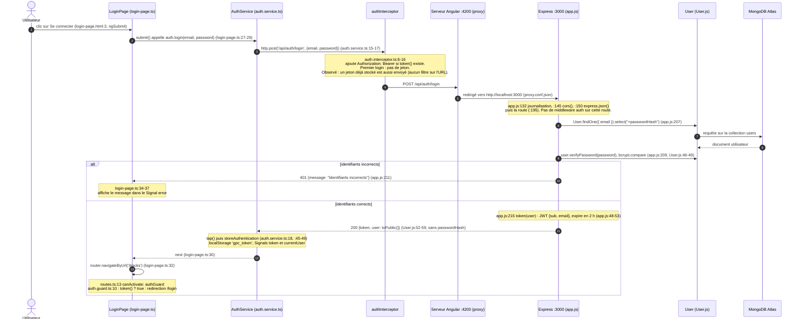

# TP1 — Flux d'un clic sur « Se connecter »

Chemin complet, du clic à la redirection. Chaque étape est numérotée et référence le fichier et la ligne concernés.

## Après la connexion : requêtes protégées

Pour toute requête suivante (par exemple `GET /api/tracks`), `authInterceptor` ajoute `Authorization: Bearer <jeton>`. Côté serveur, le middleware `auth` (`app.js:56-77`) vérifie la signature et la date avec `jwt.verify`, place le contenu du jeton dans `req.auth`, puis la route filtre les données par `req.auth.sub` (`app.js:275`).

## Observations dans les DevTools (onglet Network)

- La requête part vers `localhost:4200/api/auth/login` (port du serveur Angular), pas vers `:3000` : c'est le proxy qui la transmet au backend.
- Connexion réussie : statut `200`, corps de réponse `{token, user}`.
- Connexion refusée (mauvais mot de passe) : statut `401`, corps `{"message":"Identifiants incorrects"}`.
- Lorsqu'un jeton était déjà enregistré, l'en-tête `Authorization` était présent sur la requête de connexion elle-même ; le backend l'ignore, cette route n'exigeant pas de jeton.
